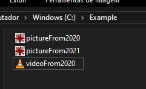

# **Files Organizer Per Year**


<p align="center"> 🚀 Files Organizer Per Year is a program created to organize files in a directory (can have N directories inside) according to the date it was modified, moving to folders with the year it was created/changed. </p>

### **Input Directory**



### **Output Directory after exec "cargo run -- -d C:\Example -o C:\Output"**


🏁 Table of Contents

===================

<!--ts-->

👉 [Dependencies and Environment](#dependenciesandenvironment)

👉 [Using](#using)

👉 [Learn More](#learnmore)

👉 [License](#license)

👉 [Author](#author)

<!--te-->

===================

<div id="dependenciesandenvironment"></div>

## 💻 **Dependencies and Environment**

- SO: Windows 10
- Rust (rustc 1.75.0 (82e1608df 2023-12-21))
- Cargo (cargo 1.75.0 (1d8b05cdd 2023-11-20))

<div id="using"></div>

## ☕ **Using**

To run, just executing the code:

```bash
cargo run -- -d YOUR_INPUT_DIRECTORY
```

You can still use the **-o** flags to define an output directory and also the **-x** flag if you want to cut the input files to the output directory instead of copying them

If you need help with using program, you can execute:

```bash
cargo run -- --help
```

**OBS**: The program don`t ignore hidden files! (Its can a new feature)

<div id="learnmore"></div>

## 📖 **Learn More**

To learn more about technologies used in the application:

- [Rust](https://www.rust-lang.org/) - learn about Rust.

<div id="license"></div>

## 🔒 **License**

Projects have [MIT license](LICENSE).

<div id="author"></div>

#### **👷 Author**

Made by Glener Pizzolato! 🙋

[](https://www.linkedin.com/in/glener-pizzolato-6319821b0/)
[](mailto:glenerpizzolato@gmail.com)
